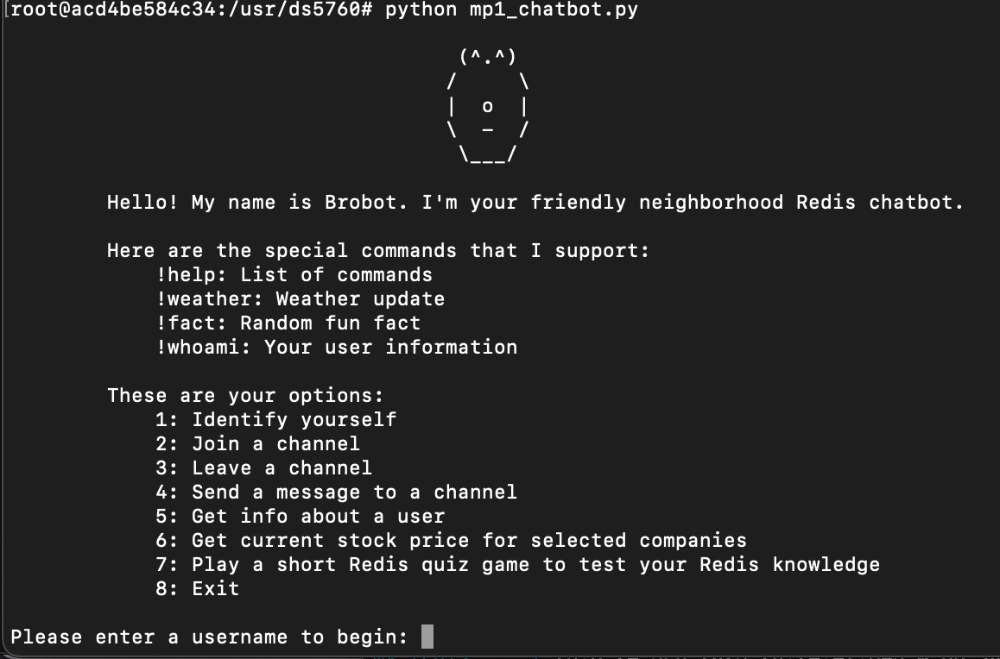
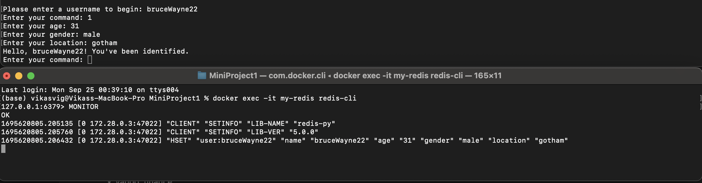
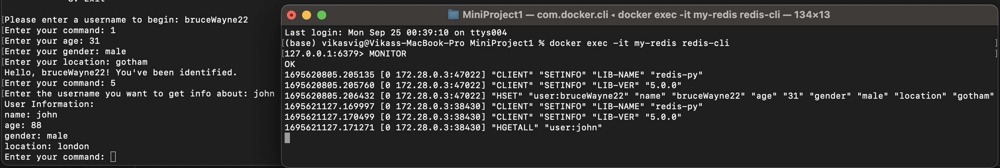
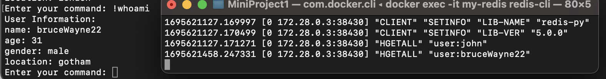
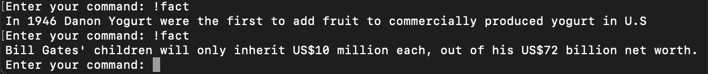
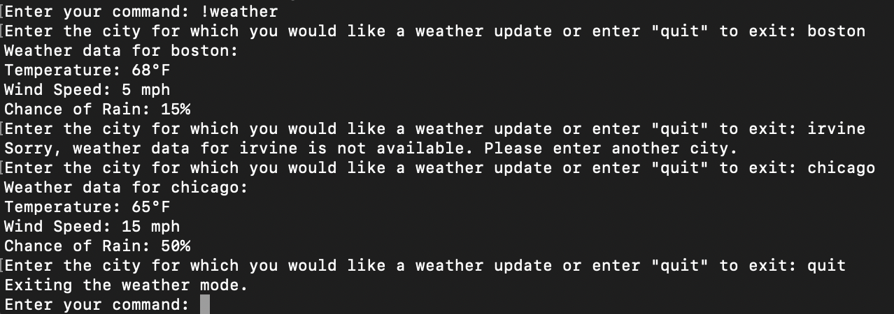
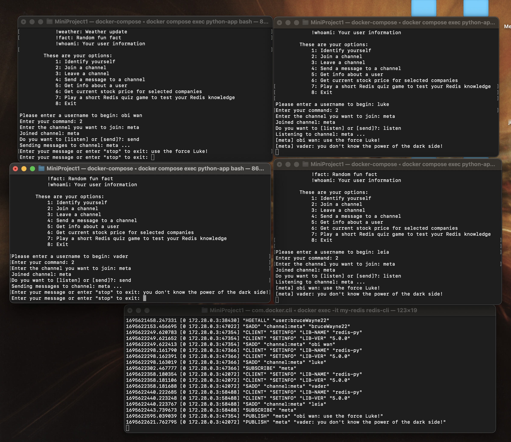
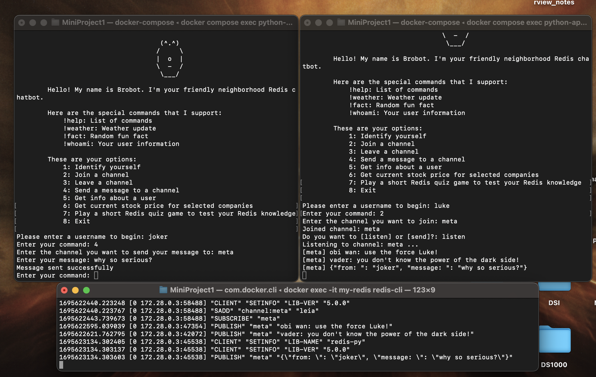
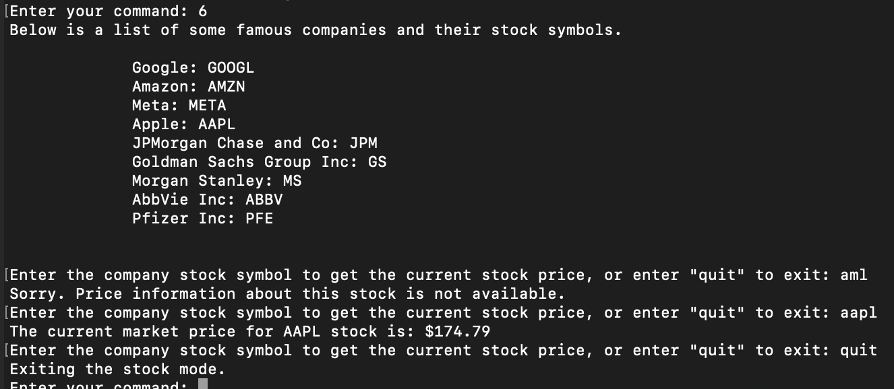
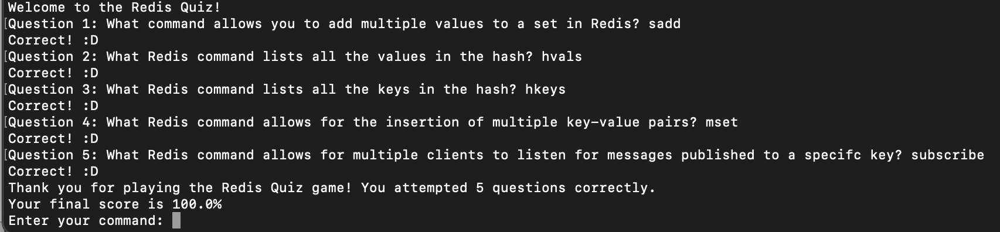

# DS5760 NoSQL for Modern Data Science Applications:
# Mini Project 1: Building a Redis Pub/Sub-Based Chatbot

## About


Brobot is a simple Redis based chatbot. It can be used to send messages, join and leave channels, and get information about other users in the database. Brobot also has these additional features:
* A random fact generator that allows users to read a random fact for their learning or entertainment
* Live stock price scraping, which allows users to retrieve the current market stock price from some of the world's biggest companies, such as Apple, Google, and JPMorgan Chase
* A short Redis quiz, which allows users to test their Redis knowledge

The full list of possible commands is as follows:

- Special commands:
    * !help: List of commands
    * !weather: Weather update
    * !fact: Random fun fact
    * !whoami: Your user information

- Regular options:
    * Identify yourself
    * Join a channel
    * Leave a channel
    * Send a message to a channel
    * Get info about a user
    * Get current stock price for selected companies
    * Play a short Redis quiz game to test your Redis knowledge
    * Exit
        


## Files
* docker-compose.yml <-- The file used to create the Redis and Python client containers
* mp1_chatbot.py <-- This is the main chatbot code

## Development Process
Docker was used to create two containers: a Redis container and a Python client container. The details for these containers were specified in the docker-compose.yml file. Next, the following code was run in the desired directory to set up the containers and build connections between them, allowing Redis and Python to work together:
```
docker-compose up
```
After this, the rest of the development was done exclusively in Python, in the mp1_chatbot.py file. Redis was imported into the Python script, allowing the Python code to execute Redis commands. 

## Requirements
Brobot requires the following:
* Docker
* Python
* Redis
* randfact
* yahoo_finance

## Installation
The required tools can be installed via pip. As an example, the code block below shows how to install Redis.
```
pip install redis
```

## Usage and Real-Time Monitoring

The screenshots below show examples of how to use Brobot. 

For some of these examples, the following Redis command is used to monitor a user interacting with Brobot in real-time.
```
Redis-cli MONITOR
```

### Entering user information
Users can enter their information to be added to the database.



### Retrieving information about other users
Users can retrieve information about other users in the database by giving Brobot the desired username.



### Special command example (!whoami)
Brobot retrieves user information when given the command `!whoami`



### Special command example (!fact)
Brobot displays a random fact to the user when given the command `!fact`



### Special command example (!weather)
Brobot retrieves weather information for stored cities when given the command `!weather`



### Joining a Channel and Publishing/Listening Examples

#### Example 1: Four users join the same channel
In this example, there are four users in total: two senders (publishers) and two listeners (subscribers). This example demonstrates that multiple users are able to use Brobot to send or receive messages when joined to the same channel.



#### Example 2: Sending a message from outside the channel
It is possible for users to send a message to a channel without joining the channel. All subscribers to the channel will still receive the message. However, note the difference in how the message is displayed to the subscribers compared to Example 1 above. This is intentional and indicates that the message was sent by a user who has not joined the channel. 



### Get stock price example 
Users can choose to use Brobot's stock price scraper, which will display the current stock price for stored companies.



### Play Redis quiz example
Users can choose to take Brobot's built-in Redis quiz to test their Redis knowledge.



